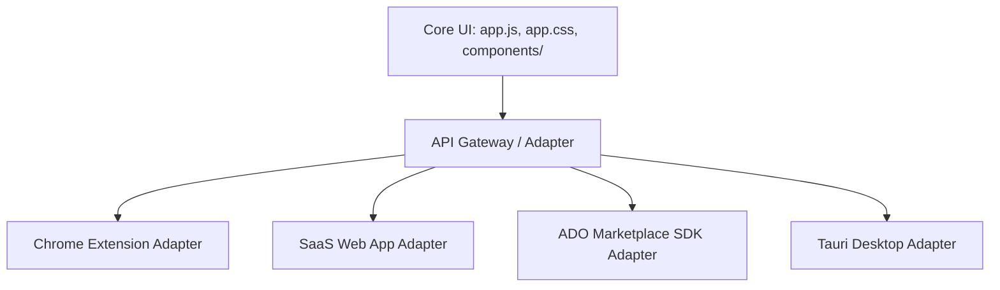

# Спецификация: Расширение каналов распространения ADO Atlas

Этот документ описывает технический план и архитектурные изменения, необходимые для масштабирования ADO Atlas за пределы Chrome Web Store в три новых канала: Standalone Web App (SaaS), Native Azure DevOps Marketplace Extension и Desktop App (Tauri).

---

## 1. Архитектурная реорганизация (Портируемость кода)

Чтобы один и тот же код визуализации (Timeline, Graph, Board, Tree) работал во всех средах, необходимо отделить логику отображения от логики получения данных и авторизации.

### Текущее состояние:
Код жестко завязан на специфичные для расширения Chrome API (`chrome.storage.local`, прямые fetch-запросы без ограничений CORS в фоновом режиме).

### Целевая архитектура (Паттерн "Адаптер"):
Мы выделяем интерфейс доступа к данным и авторизации, реализуя его отдельно для каждой среды:



---

## 2. Канал 1: Standalone Web App (SaaS на `app.adoatlas.com`)

Цель — дать пользователям возможность попробовать продукт без установки расширения и делиться ссылками на таймлайны с коллегами.

### А. Решение проблемы CORS
Поскольку обычные веб-страницы ограничены правилами CORS при запросах к `dev.azure.com`, реализуются два пути:
1. **OAuth 2.0 (Entra ID):** Использование Microsoft Identity Platform с Redirect URI на веб-сайт. Microsoft выдает токен, который может использоваться для CORS-запросов со страницы приложения.
2. **Серверный API-прокси (Vercel / Firebase Functions):** 
   * Запросы отправляются на `/api/proxy?url=https://dev.azure.com/...`
   * Сервер принимает запрос, подставляет токен авторизации (PAT или OAuth), делает запрос к Azure DevOps и возвращает ответ обратно в UI.

### Б. Функция «Поделиться таймлайном» (Share Link)
* Премиум-пользователь нажимает кнопку **«Share View»**.
* Данные о проекте (или отфильтрованный слепок задач) сериализуются и сохраняются в базу данных Firebase Firestore под уникальным ID.
* Генерируется ссылка вида `adoatlas.com/share/{share_id}`.
* Любой человек по этой ссылке видит интерактивный, но read-only таймлайн без необходимости логина и установки плагина.

---

## 3. Канал 2: Native Azure DevOps Marketplace Extension (Для корпораций)

Цель — дистрибуция на уровне всей организации. Установка расширения администратором один раз внедряет вкладку ADO Atlas для сотен пользователей внутри интерфейса Azure DevOps.

### А. Интеграция с Azure DevOps SDK
* В проект подключается официальная библиотека Microsoft: `azure-devops-extension-sdk`.
* Приложение запускается внутри iframe на страницах Azure DevOps.
* **Авторизация:** SDK предоставляет бесшовный метод получения токена доступа текущей сессии:
  ```javascript
  import * as SDK from "azure-devops-extension-sdk";
  
  SDK.init().then(async () => {
      const accessToken = await SDK.getAppToken();
      // Используем токен для запросов к REST API
  });
  ```
* Данные о текущем проекте и организации считываются автоматически из контекста страницы (`SDK.getHostContext()`).

### Б. Визуальная интеграция
* UI адаптируется под стили Azure DevOps. С помощью CSS-переменных тема расширения (цвета шрифтов, фоны, скругления) синхронизируется с системной темой ADO (светлая/тёмная).

---

## 4. Канал 3: Standalone Desktop App (Tauri / Electron)

Цель — предоставить пользователям ощущение полноценного профессионального десктопного софта, независимого от вкладок браузера, с локальным сохранением данных.

### А. Выбор Tauri вместо Electron
Tauri предпочтительнее Electron по следующим причинам:
* **Размер дистрибутива:** ~3-5 МБ (Tauri использует системный Webview) против ~80-100 МБ у Electron.
* **Потребление ресурсов:** Минимальное использование оперативной памяти.
* **Безопасность:** Встроенный бэкенд на Rust.

### Б. Решение проблемы CORS и локального хранилища
* Tauri выполняет fetch-запросы на уровне системных вызовов ОС, полностью обходя ограничения CORS браузера. Это позволяет использовать PAT-токены напрямую без каких-либо прокси-серверов.
* Настройки и кэш сохраняются в файлы конфигурации системы (`AppData`/`Application Support`).

---

## 5. Сводная матрица дистрибуции

| Характеристика | Chrome Extension | Standalone SaaS | ADO Marketplace | Desktop App (Tauri) |
| :--- | :--- | :--- | :--- | :--- |
| **Сложность установки** | Низкая (1 клик) | **Нулевая** (просто сайт) | Низкая (только для админа) | Средняя (скачать installer) |
| **Охват аудитории** | Chrome/Edge юзеры | **Все платформы и мобильные** | Корпоративные аккаунты | Windows/macOS/Linux |
| **Авторизация** | PAT или OAuth (BYO) | OAuth 2.0 + Proxy | **Бесшовная (Native SDK)** | PAT / OAuth |
| **Обход CORS** | Нативно расширением | Через OAuth/Proxy | Внутри контекста ADO | Нативно на уровне ОС |
| **Монетизация** | Подписка в расширении | Подписка на сайте (SaaS) | B2B Лицензии организации | Лицензионный ключ |

---

## 6. Поэтапный план перехода

### Фаза 1: Рефакторинг Data Layer (1 неделя)
* Выделение всех обращений к API Azure DevOps в класс-сервис `DevOpsService`.
* Выделение работы с хранилищем в `StorageService` (для изоляции `chrome.storage.local`).
* Подготовка абстракций для разных сред.

### Фаза 2: Сборка Web App и Настройка OAuth (1-2 недели)
* Развертывание статического фронтенда на хостинге (Vercel / Firebase Hosting).
* Настройка OAuth-приложения в Azure Portal для поддержки авторизации на веб-сайте.
* Добавление прокси для запросов к API Azure DevOps.

### Фаза 3: Разработка пакета для Azure DevOps Marketplace (1-2 недели)
* Создание конфигурационного файла манифеста `vss-extension.json`.
* Адаптация Data Layer под `azure-devops-extension-sdk`.
* Публикация в Visual Studio Marketplace в режиме "Private/Shared" для тестирования на тестовой организации.

### Фаза 4: Сборка Tauri Desktop (1 неделя)
* Инициализация Tauri-проекта поверх текущего фронтенда (`npm run tauri init`).
* Настройка прав доступа к сети в `tauri.conf.json`.
* Компиляция установщиков под Windows (.msi) и macOS (.dmg).
